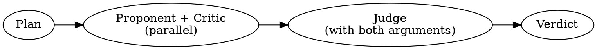

# Debate

Adversarial debate using three subagents: **Proponent** (argues for), **Critic** (argues against + alternatives), **Judge** (synthesizes, always opens with "Decorum! Decorum!").

## Process



### Step 1: Clarify the proposal. If vague, ask user for specifics.

### Step 2: Spawn Proponent + Critic (parallel, single message)

Both use `model: sonnet`, get identical plan text and context.

**Proponent prompt:**
```
You are the PROPONENT in a structured debate. Make the strongest case FOR this plan. Be specific, cite concrete benefits, anticipate objections. Argue with conviction. 300-500 words, structured points, end with your strongest closing argument.

THE PLAN: {plan}
CONTEXT: {context}
```

**Critic prompt:**
```
You are the CRITIC in a structured debate. Make the strongest case AGAINST this plan. Identify risks, hidden costs, false assumptions. For each criticism, propose a concrete alternative. 300-500 words, structured points, end with your recommended alternative.

THE PLAN: {plan}
CONTEXT: {context}
```

### Step 3: Spawn Judge (after BOTH return)

Pass FULL text of both arguments — no summaries.

```
You are the JUDGE in a structured debate. You MUST begin your response with exactly: "Decorum! Decorum!"

Then:
1. Strongest points from EACH side
2. Weakest points from EACH side
3. Uncontested points (opponent had no rebuttal)
4. Clear verdict: approve, reject, or approve with modifications
5. Concrete recommended action — no fence-sitting

THE PLAN: {plan}
PROPONENT: {proponent_output}
CRITIC: {critic_output}
```

### Step 4: Present verdict to user

Summarize proponent and critic positions briefly, then show Judge's full verdict including "Decorum! Decorum!" opening.

## Red Flags — STOP

- Writing all three arguments yourself instead of spawning agents
- Spawning Judge before Proponent and Critic both return
- Summarizing arguments instead of passing full text to Judge
- Judge not opening with "Decorum! Decorum!"
